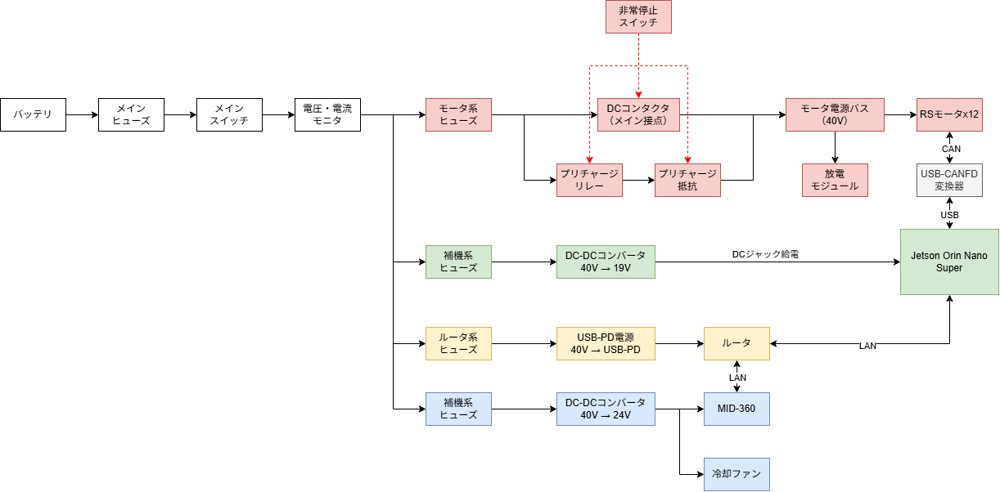

# 電装システム構成

本ロボットの電装システム全体の構成を以下に示す。

## システム構成図

本システムは、主に以下の系統から構成される。

- モータ駆動系
- 制御・演算系
- センサ系
- ネットワーク系
- 安全系

電源容量やDC-DCコンバータの選定については、[電源設計](power/)を参照。

## モータ駆動系

バッテリーからメインヒューズ、メインスイッチ、電圧・電流モニタ、
モータ系ヒューズ、DCコンタクタを介してモータ電源バスへ電源を供給する。

モータ電源バスにはRobStrideモータを接続する。

また、DCコンタクタ投入時の突入電流を抑制するため、
プリチャージ回路を設ける。

## 制御・演算系

Jetson Orin Nano Superをメインコンピュータとして使用する。

Jetsonには40 V系電源からDC-DCコンバータを介して19 Vを供給する。

## モータ通信

JetsonとRobStrideモータ間の通信にはCANを使用する。

JetsonとはUSB-CAN FD変換器を介して接続する。

## センサ系

MID-360には40 V系電源からDC-DCコンバータを介して24 Vを供給する。

MID-360とJetson間はEthernetで通信する。

## ネットワーク系

ルータには40 V系電源からUSB-PD電源を介して給電する。

JetsonとルータはEthernetで接続する。

## 安全系

非常停止スイッチによってDCコンタクタを遮断し、
モータ電源バスへの電源供給を停止できる構成とする。
